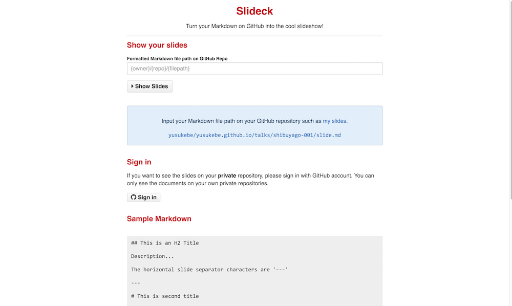

# Slideck

---

## tl;dr

* Slideck is a new web service
* Formatted Markdown text on GitHub Repo
* will be showed as slideshow

<https://slideck.io/>

---

## I'm...

* Yusuke Wada a.k.a. yusukebe
* <https://github.com/yusukebe>


---

## I ♥ love...

* Doing Presentaion
* Making Slides
* Keynote

And...

---

## reveal.js!

<https://github.com/hakimel/reveal.js/>

---

## Markdown driven presentation

```
## This is an H2 Title

Description...

The horizontal slide separator characters are '---'

```

* Easy to write
* Good for showing programming code

---

## reveal.js Wrapper Apps

* [App::revealup](https://metacpan.org/pod/App::revealup)
* [revealgo](https://github.com/yusukebe/revealgo)

These apps are useful for previwing on **localhost**.

But only on **localhost**.

---

## I need online tool

* Online access to the slides
* Share URL quickly
* Inspired by `godoc.org`

---

## Slideck

---



---

## Feature

Markdown on GitHub repo will be showed as shlideshow

* Compatible with reveal.js/revealgo
* Embeded assets such as image files
* Support private repo with GitHub sign in
* Sanitize generated HTML from Markdown

---

## Usage

* Write formatted Markdown text
* `git push` to your own GitHub repo
* Access to `/github.com/{owner}/{repo}/{path}`

---

## Example

* This Markdown Path : `github.com/yusukebe/slides/slideck.md`
* Slideck URL : <https://slideck.io/github.com/yusukebe/slides/slideck.md>

---

## Implementation

* Golang + Heroku

```
"github.com/google/go-github/github"
"github.com/microcosm-cc/bluemonday"
"github.com/russross/blackfriday"
"golang.org/x/oauth2"
"golang.org/x/oauth2/github"
"github.com/ymichael/sessions"
"github.com/zenazn/goji"
"github.com/zenazn/goji/web"
```

---

## Try Slideck now!

<https://slideck.io>

